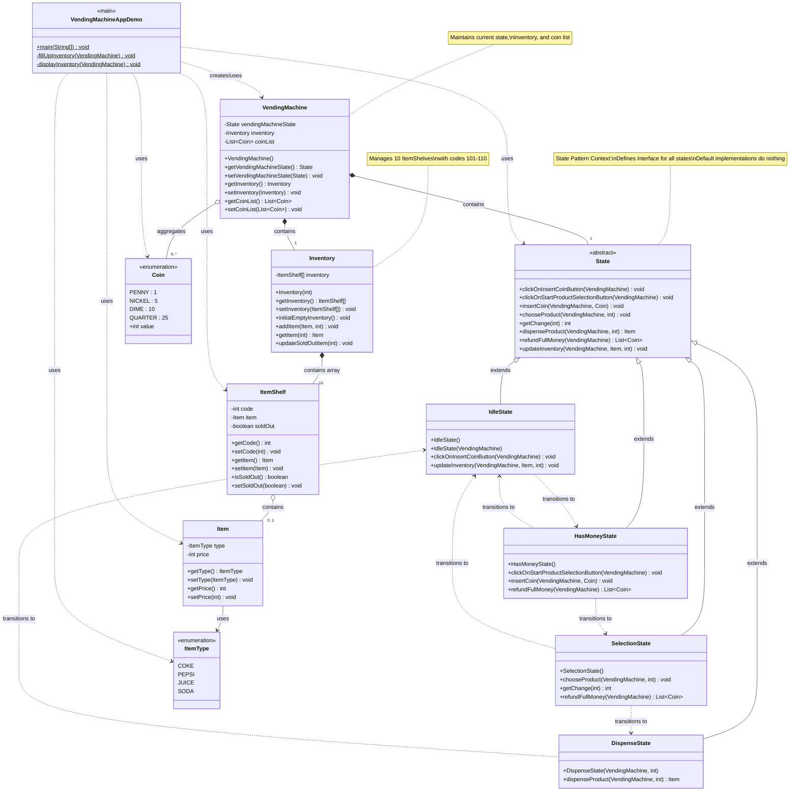
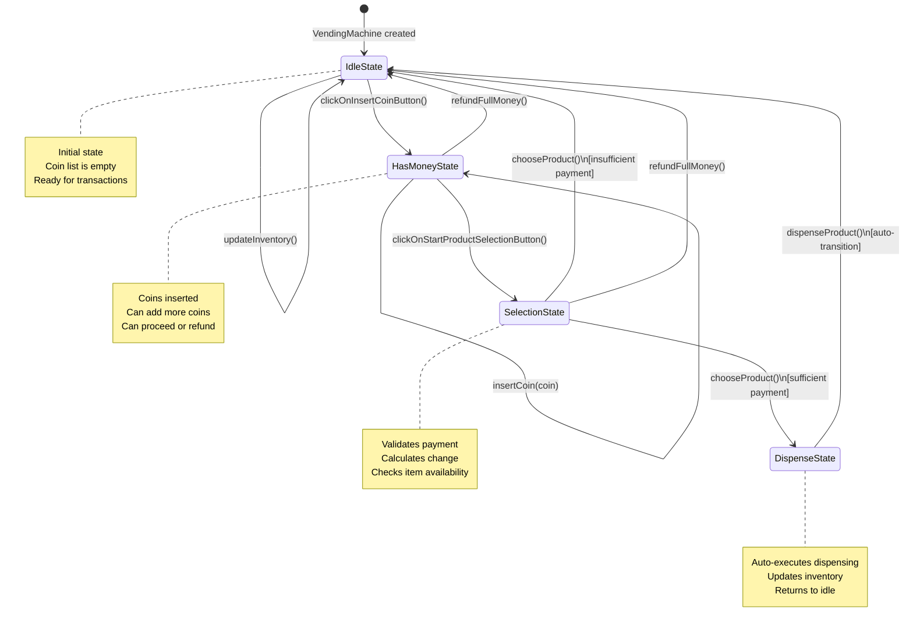
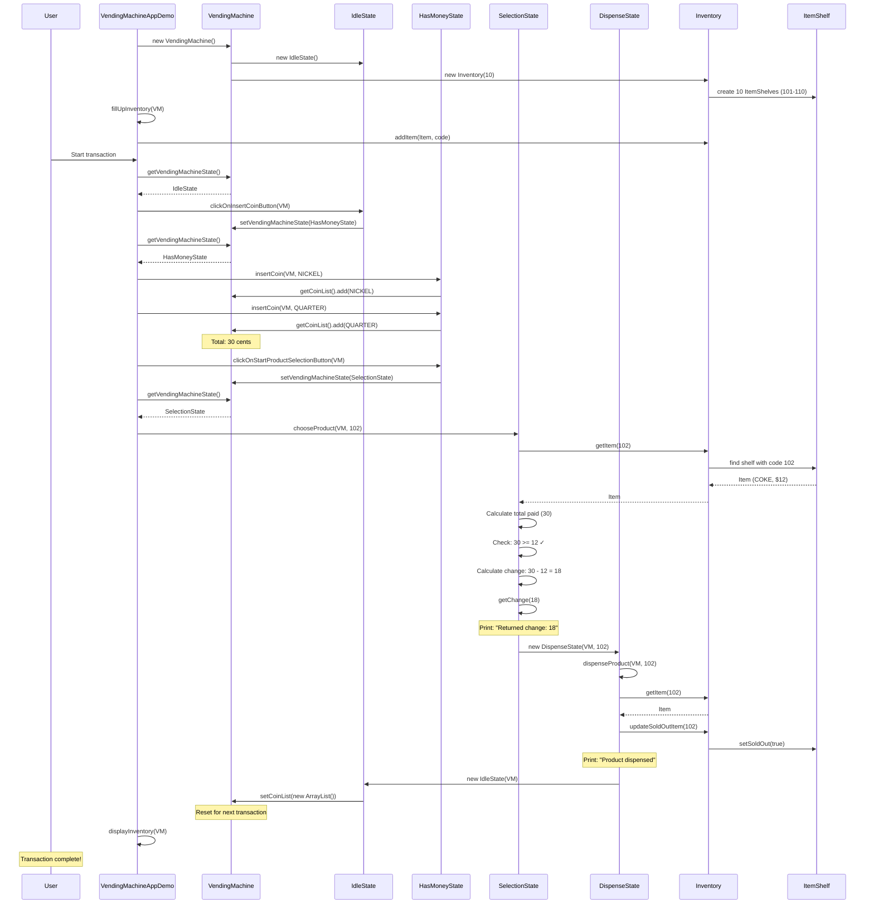
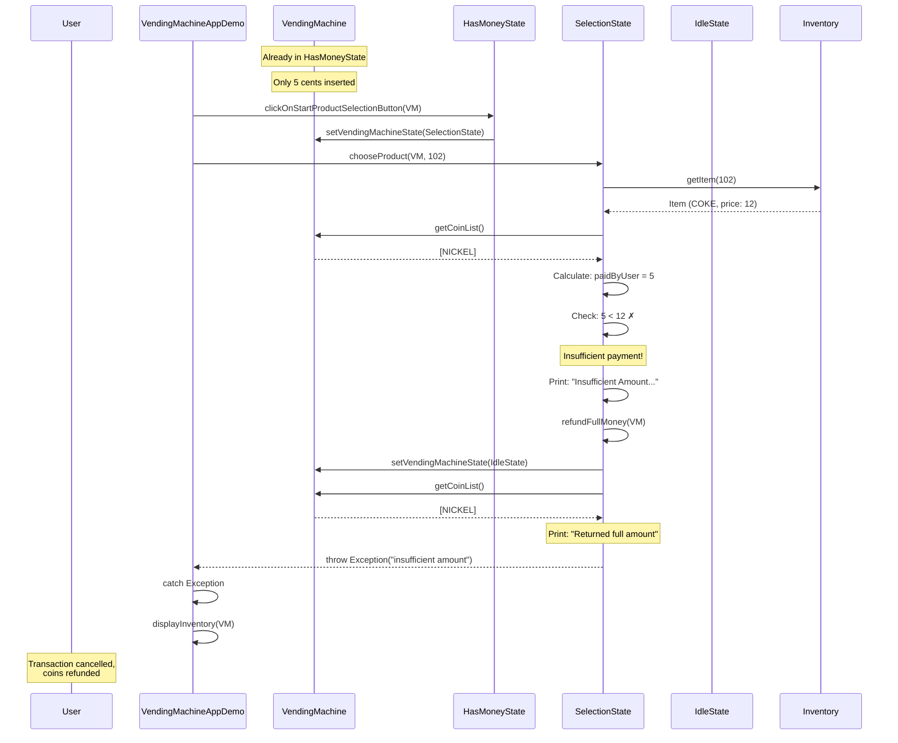

# Vending Machine System - Design Documentation

## Requirements

### Functional Requirements
1. **Product Selection**: Users can select products using code numbers (101-110)
2. **Payment Processing**: Accept multiple coin denominations (Penny, Nickel, Dime, Quarter)
3. **Change Management**: Return exact change when overpayment occurs
4. **Refund Capability**: Allow full refund of inserted coins before product selection
5. **Inventory Management**: Track product availability and mark items as sold out
6. **Product Dispensing**: Dispense selected product after successful payment
7. **State Transitions**: Machine transitions through appropriate states during transaction

### Non-Functional Requirements
1. **Maintainability**: Easy to add new states or modify existing behavior
2. **Extensibility**: Support adding new product types and coin denominations
3. **Reliability**: Handle insufficient funds and sold-out scenarios gracefully
4. **Simplicity**: Clear and understandable code structure

## Objectives

### Primary Objectives
1. **Implement State Pattern**: Manage vending machine behavior across different states
2. **Separation of Concerns**: Isolate inventory, payment, and dispensing logic
3. **Error Handling**: Gracefully handle exceptional scenarios (insufficient funds, invalid codes, sold out items)
4. **User Experience**: Provide clear feedback at each transaction step

### Design Objectives
1. Create a flexible architecture supporting future enhancements
2. Minimize coupling between components
3. Maximize code reusability
4. Follow SOLID principles

## Design Patterns Used

### 1. State Pattern (Implemented)
**Purpose**: Manage vending machine behavior that changes based on internal state

**Implementation**:
- **Context**: `VendingMachine` class maintains current state
- **State Interface**: Abstract `State` class defines all possible operations
- **Concrete States**: 
  - `IdleState`: Initial state, waiting for user to insert coins
  - `HasMoneyState`: Coins inserted, ready for product selection
  - `SelectionState`: Product being selected, validating payment
  - `DispenseState`: Dispensing product and returning change

**Benefits**:
- Eliminates complex conditional logic (no giant if-else chains)
- Each state encapsulates its own behavior
- Easy to add new states without modifying existing code
- State transitions are explicit and type-safe

**How it works in the code**:
```java
// VendingMachine acts as Context
State vendingState = vendingMachine.getVendingMachineState();
vendingState.clickOnInsertCoinButton(vendingMachine);
// State changes from IdleState to HasMoneyState
```

### 2. Strategy Pattern (Potential Application)
**Where it could be applied**: Payment processing and change calculation

**Current Implementation Pain Points**:
- Change calculation is hardcoded in `SelectionState.getChange()`
- Only supports coin-based payment
- Cannot easily add card payment, mobile payment, etc.

**How Strategy Pattern would help**:
```java
interface PaymentStrategy {
    boolean processPayment(int amount);
    int calculateChange(int paid, int price);
    void refund();
}

// Different strategies for different payment types
class CoinPaymentStrategy implements PaymentStrategy { }
class CardPaymentStrategy implements PaymentStrategy { }
class DigitalWalletStrategy implements PaymentStrategy { }
```

**Benefits**:
- Swap payment algorithms at runtime
- Add new payment methods without changing VendingMachine
- Each strategy independently testable

### 3. Chain of Responsibility Pattern (Potential Application)
**Where it could be applied**: Product selection validation

**Current Implementation**:
- `SelectionState.chooseProduct()` does multiple validations sequentially
- Tightly coupled validation logic

**How Chain of Responsibility would help**:
```java
abstract class ValidationHandler {
    protected ValidationHandler next;
    
    public void setNext(ValidationHandler handler) {
        this.next = handler;
    }
    
    public abstract boolean validate(VendingMachine machine, int code);
}

// Chain: CodeValidator -> StockValidator -> PaymentValidator
class CodeValidator extends ValidationHandler {
    public boolean validate(VendingMachine machine, int code) {
        // Check if code exists in inventory
        if (valid) return next == null || next.validate(machine, code);
        return false;
    }
}

class StockValidator extends ValidationHandler {
    public boolean validate(VendingMachine machine, int code) {
        // Check if item is in stock
        if (inStock) return next == null || next.validate(machine, code);
        return false;
    }
}

class PaymentValidator extends ValidationHandler {
    public boolean validate(VendingMachine machine, int code) {
        // Check if payment is sufficient
        return sufficientPayment;
    }
}
```

**Benefits**:
- Decouple validation logic into separate handlers
- Add/remove validation steps dynamically
- Each handler has single responsibility
- Easy to reorder validation sequence

## UML Class Diagram



## State Transition Diagram



## Sequence Diagram - Successful Purchase Flow



## Sequence Diagram - Insufficient Payment Flow



## Class Responsibilities

### VendingMachine (Context)
- **Purpose**: Central coordinator for the vending machine
- **Responsibilities**:
  - Maintain current state
  - Manage inventory
  - Track inserted coins
  - Delegate operations to current state
- **Key Methods**: State management, inventory access, coin list management

### State (Abstract)
- **Purpose**: Define interface for all possible operations
- **Responsibilities**:
  - Declare all state-specific operations
  - Provide default implementations (do nothing)
  - Allow subclasses to override only relevant methods
- **Pattern Role**: State interface in State Pattern

### IdleState
- **Purpose**: Initial waiting state
- **Responsibilities**:
  - Transition to HasMoneyState when coin button clicked
  - Allow inventory updates
  - Reset coin list when entering from other states
- **Valid Operations**: `clickOnInsertCoinButton()`, `updateInventory()`

### HasMoneyState
- **Purpose**: Accept coins and prepare for selection
- **Responsibilities**:
  - Accept additional coins
  - Transition to SelectionState
  - Handle refund requests
  - Accumulate payment
- **Valid Operations**: `insertCoin()`, `clickOnStartProductSelectionButton()`, `refundFullMoney()`

### SelectionState
- **Purpose**: Process product selection and validate payment
- **Responsibilities**:
  - Validate product code
  - Check item availability
  - Verify sufficient payment
  - Calculate and return change
  - Handle insufficient payment with refund
  - Transition to DispenseState or IdleState
- **Valid Operations**: `chooseProduct()`, `getChange()`, `refundFullMoney()`

### DispenseState
- **Purpose**: Dispense product and complete transaction
- **Responsibilities**:
  - Retrieve selected item
  - Mark item as sold out
  - Return to IdleState
  - Auto-execute dispensing in constructor
- **Valid Operations**: `dispenseProduct()` (called automatically)

### Inventory
- **Purpose**: Manage product storage and availability
- **Responsibilities**:
  - Initialize 10 item shelves (codes 101-110)
  - Add items to shelves
  - Retrieve items by code
  - Update sold-out status
  - Validate item availability
- **Key Feature**: Array-based storage with code mapping

### ItemShelf
- **Purpose**: Represent single storage location
- **Responsibilities**:
  - Store unique code (101-110)
  - Hold item reference
  - Track availability status
- **Data Structure**: Container for Item with metadata

### Item
- **Purpose**: Represent vendable product
- **Responsibilities**:
  - Store product type
  - Store product price
- **Simple Data**: POJO with type and price

### ItemType (Enum)
- **Purpose**: Define available product types
- **Values**: COKE, PEPSI, JUICE, SODA
- **Usage**: Type-safe product categorization

### Coin (Enum)
- **Purpose**: Define coin denominations
- **Values**: PENNY(1), NICKEL(5), DIME(10), QUARTER(25)
- **Usage**: Payment calculation with cent values

### VendingMachineAppDemo
- **Purpose**: Demonstrate system usage
- **Responsibilities**:
  - Initialize vending machine
  - Fill inventory with sample products
  - Simulate user interactions
  - Display inventory status
  - Handle exceptions

## Key Design Insights

### Strengths
1. **Clean State Management**: Each state handles only its valid operations
2. **No Conditional Complexity**: No large if-else chains for state-dependent behavior
3. **Automatic Transitions**: DispenseState automatically transitions to IdleState
4. **Fail-Safe Defaults**: Invalid operations are no-ops by default
5. **Clear Separation**: Inventory, payment, and state logic are decoupled

### Current Limitations
1. **No change calculation algorithm**: Just returns amount, doesn't break into coins
2. **No concurrent transaction support**: Single-threaded design
3. **Limited error handling**: Generic exceptions without specific types
4. **No persistence**: All data lost when application ends
5. **Hard-coded inventory**: 10 items, codes 101-110

### Potential Enhancements with Strategy Pattern
- **Payment Processing**: Different payment methods (coins, cards, mobile)
- **Change Calculation**: Optimal coin selection algorithms
- **Pricing Strategies**: Dynamic pricing, discounts, promotions
- **Inventory Restocking**: Different restocking algorithms

### Potential Enhancements with Chain of Responsibility
- **Validation Pipeline**: Code → Availability → Payment → Expiry checks
- **Error Handling**: Multiple error handlers in sequence
- **Logging Chain**: Multiple loggers (console, file, remote)
- **Authorization Chain**: Role-based access for maintenance operations

## Testing Scenarios

### Happy Path
1. Machine starts in IdleState
2. User clicks insert coin button → HasMoneyState
3. User inserts NICKEL (5) and QUARTER (25) → Total: 30 cents
4. User clicks product selection button → SelectionState
5. User selects code 102 (COKE, $12) → Sufficient payment
6. Machine calculates change: 30 - 12 = 18 cents
7. Machine transitions to DispenseState → Product dispensed
8. Machine returns to IdleState

### Error Cases
1. **Insufficient Payment**: User pays less than product price → Refund and IdleState
2. **Invalid Code**: User selects non-existent code → Exception thrown
3. **Sold Out**: User selects already sold item → Exception thrown
4. **Refund Request**: User requests refund in HasMoneyState → Return coins, IdleState

## Conclusion

This vending machine implementation demonstrates the **State Pattern** effectively, providing a clean and maintainable solution for managing state-dependent behavior. The architecture is ready for enhancement with **Strategy Pattern** for payment processing and **Chain of Responsibility** for validation pipelines, making it a solid foundation for a production system.
