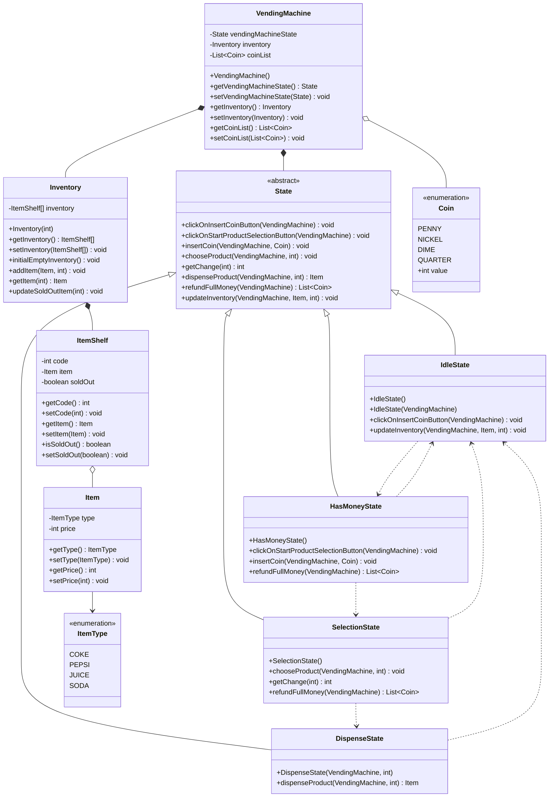
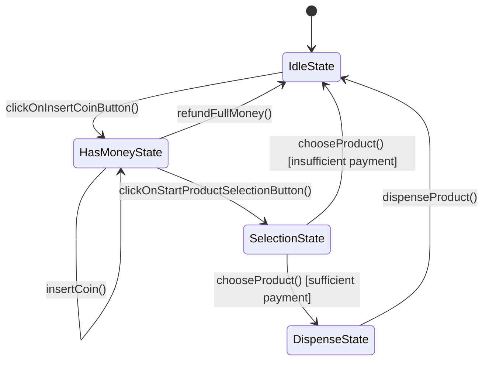

# Vending Machine System - UML Diagram

## Class Diagram

## Class Descriptions

### Core Classes

**VendingMachine** (Context)
- Maintains current state, inventory, and coin list
- Delegates operations to current state object

**State** (Abstract)
- Defines interface for all states
- Default implementations do nothing (no-op pattern)

### State Implementations

**IdleState**
- Initial state, waiting for user interaction
- Can accept coin button click or inventory updates

**HasMoneyState**
- Coins inserted, ready for product selection
- Can accept more coins, proceed to selection, or refund

**SelectionState**
- Processing product selection
- Validates payment and calculates change
- Transitions to DispenseState or IdleState

**DispenseState**
- Dispenses product automatically
- Updates inventory and returns to IdleState

### Inventory Classes

**Inventory**
- Manages 10 ItemShelves with codes 101-110
- Handles item addition, retrieval, and updates

**ItemShelf**
- Represents single storage slot
- Contains code, item, and availability status

**Item**
- Represents vendable product
- Contains type and price

### Enumerations

**ItemType**
- Product types: COKE, PEPSI, JUICE, SODA

**Coin**
- Denominations: PENNY(1), NICKEL(5), DIME(10), QUARTER(25)

## Relationships

| Relationship | From | To | Type | Description |
|--------------|------|-----|------|-------------|
| Inheritance | IdleState, HasMoneyState, SelectionState, DispenseState | State | extends | State pattern implementation |
| Composition | VendingMachine | State | contains | VendingMachine owns State |
| Composition | VendingMachine | Inventory | contains | VendingMachine owns Inventory |
| Aggregation | VendingMachine | Coin | uses | VendingMachine uses Coins |
| Composition | Inventory | ItemShelf | contains | Inventory contains ItemShelves |
| Aggregation | ItemShelf | Item | contains | ItemShelf contains Item |
| Dependency | Item | ItemType | uses | Item uses ItemType enum |
| Dependency | IdleState | HasMoneyState | creates | State transition |
| Dependency | HasMoneyState | SelectionState | creates | State transition |
| Dependency | HasMoneyState | IdleState | creates | State transition (refund) |
| Dependency | SelectionState | DispenseState | creates | State transition (success) |
| Dependency | SelectionState | IdleState | creates | State transition (failure) |
| Dependency | DispenseState | IdleState | creates | State transition (completion) |

## State Transition Diagram

## Design Pattern: State Pattern

This implementation uses the **State Pattern** where:

- **Context**: `VendingMachine` class
- **State Interface**: Abstract `State` class
- **Concrete States**: `IdleState`, `HasMoneyState`, `SelectionState`, `DispenseState`

**Benefits:**
- Eliminates complex conditional logic
- Each state encapsulates its behavior
- Easy to add new states
- State transitions are explicit and type-safe
